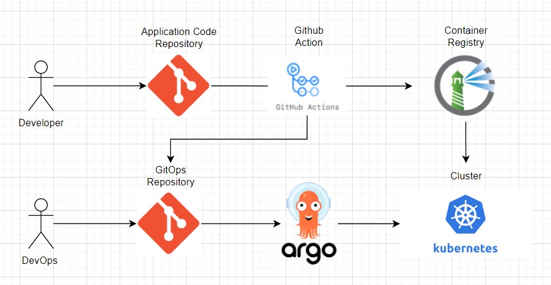

# xquare-gitops-repo-production

[1. Architecture](#Architecture)

# Architecture

## Dependencies

- kubeadm, kubelet, kubectl version: v1.24.1
- Container Runtime Interface: [CRI-O](https://cri-o.io/)
- Container Network Interface: [Calico](https://www.tigera.io/project-calico/)
- Cgroup: Systemd

## CI / CD Pipeline

## Applications

### ArgoCD

**Host**: argocd.xquare.app

- dash board
  
- dms backend service example
  

### 현재 XQUARE 프로젝트의 서비스 종류

**Host** : api.xquare.app
| service | prefix |
|---------|--------|
| 유저 서비스 | /users |
| 급식 서비스 | /meals |
| 시간표 서비스 | /timetables |
| 학과 일정 서비스 | /schedules |
| 신청 서비스 | /applications |
| 상벌점 서비스 | /points |
| 알림 서비스 | /notifications |
| 피드 서비스 | /feeds |
| 권한 서비스 | /authorities |
| 기숙사 관리 서비스 | /dms |
